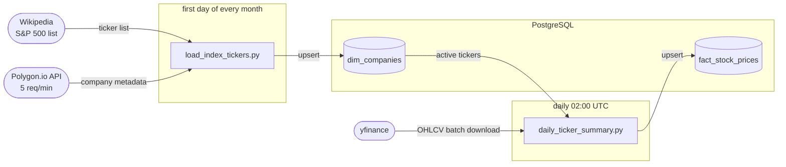

# Market Data Pipeline

An automated data pipeline for collecting and storing S&P 500 market data, built with Apache Airflow, PostgreSQL, and Docker.

## Overview

The pipeline runs two scheduled workflows:

- **Daily** - downloads OHLCV stock price data for all S&P 500 companies via yfinance and stores it in a fact table
- **Monthly** - fetches company metadata (name, industry, exchange, market cap, address) via the Polygon.io API and keeps a dimension table up to date, automatically deactivating tickers that have left the index

## Architecture



Data is modelled as a simple star schema:

| Table | Description |
|---|---|
| `market_data.dim_companies` | Company metadata, one row per ticker |
| `market_data.fact_stock_prices` | Daily OHLCV prices, one row per ticker per date |

Both tables support upserts - re-running any DAG is safe and will not produce duplicates.

## Architecture Decisions

**Two data sources for two different problems.** Polygon.io is used for company metadata: it provides accurate, licensed data. It is intentionally used with a rate limit of 5 requests/minute to simulate a bottleneck, a typical problem of real pipelines. yfinance is used for price history: downloading OHLCV data for the entire S&P 500 over a year would require 500 × 365 = 182,500 API calls with Polygon.io, which is impossible on the free tier. yfinance supports batch downloads and retrieves the full history in a handful of requests. The unofficial nature of yfinance is a known limitation acceptable for a portfolio project.

**Upserts over appends.** Both scripts use `INSERT ... ON CONFLICT DO UPDATE/NOTHING` instead of `to_sql(if_exists='append')`, making every DAG run idempotent.

## Stack

- **Orchestration** - Apache Airflow 3
- **Storage** - PostgreSQL 15
- **Data** - yfinance, Polygon.io (`massive` SDK)
- **Infrastructure** - Docker Compose

## Prerequisites

- Docker and Docker Compose
- Polygon.io API key (free tier is sufficient) - [get one here](https://polygon.io/)

## Getting Started

1. Clone the repository:
   ```bash
   git clone https://github.com/your_username/market-data-pipeline.git
   cd market-data-pipeline
   ```

2. Create a `.env` file from the example:
   ```bash
   cp .env.example .env
   ```

3. Fill in the required values in `.env`:
   ```
   AIRFLOW_UID=50000
   AIRFLOW_PROJ_DIR=./airflow
   DB_PASSWORD=your_db_password
   MASSIVE_API_KEY=your_polygon_api_key
   ```

4. Start all services:
   ```bash
   docker compose up -d
   ```

5. Open the Airflow UI at [http://localhost:8080](http://localhost:8080) and log in with `airflow` / `airflow`.

6. Enable the DAGs:
   - `market_daily_quotes` - runs daily at 02:00 UTC
   - `market_monthly_tickers` - runs on the 1st of each month at 00:00 UTC

The database is accessible on port `6432` for local clients (DBeaver, psql, etc.).

## Project Structure

```
market-data-pipeline/
├── docker-compose.yml
├── init.sql                        # Schema creation
├── .env.example
├── airflow/
│   └── dags/
│       ├── market_data_pipeline.py # DAG definitions
│       └── scripts/
│           ├── db.py               # SQLAlchemy models and engine
│           ├── load_index_tickers.py   # Monthly DAG logic
│           └── daily_ticker_summary.py # Daily DAG logic
```

## Known Limitations

- yfinance relies on an unofficial Yahoo Finance API and may break without notice if Yahoo changes their endpoints
- The Polygon.io free tier enforces a rate limit of 5 requests per minute; the monthly DAG respects this with a 12-second interval between requests
- `fact_stock_prices` only includes trading days; weekends and market holidays produce no rows
